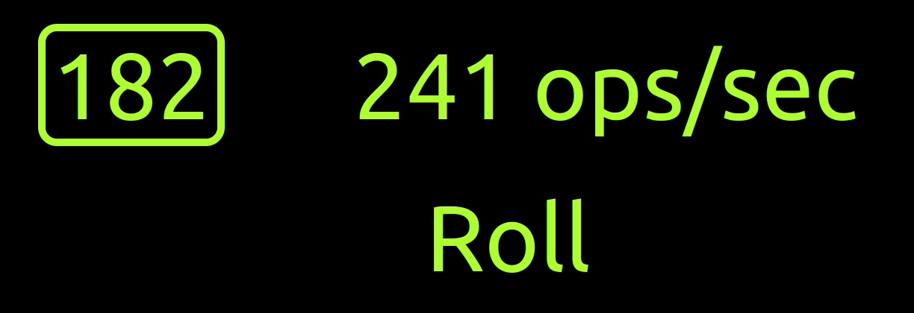

# Fluid Signals

Evaluate signals performance in Fluid framework.

## Fluid Relay Env Setup

```bash
export FLUID_MODE=frs
export SECRET_FLUID_RELAY=https://us.fluidrelay.azure.com
export SECRET_FLUID_TOKEN=xyz
export SECRET_FLUID_TENANT=xyz
```

## Tinylicious Env Setup

```bash
export FLUID_MODE=tiny
```

## Start

When using local relay, start the `tinylicious` service

```
npx tinylicious
```

```
npm run clean
npm install
npm run build
npm start
```

## Results



## Licenses

Licensed under either [Apache 2.0](http://opensource.org/licenses/MIT) or [MIT](http://opensource.org/licenses/MIT) at your option.
